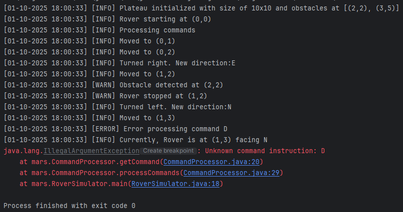

# Mars Rover Command System Simulator

This project is a console-based simulation of a Mars Rover navigating a grid-based terrain. It was developed as a coding exercise to demonstrate proficiency in **Object-Oriented Programming (OOP)**, **SOLID principles**, and advanced **Software Design Patterns**.

---

## Problem Statement

The objective is to design and implement a system that controls a Mars Rover on a $10 \times 10$ grid. The Rover must be able to:
1. Initialize with a starting position $(x, y)$ and direction (N, S, E, W).
2. Accept a series of commands: **'M'** (Move Forward), **'L'** (Turn Left), and **'R'** (Turn Right).
3. Detect and avoid **obstacles**.
4. Remain within the grid **boundaries**.

The key technical challenge is to achieve all movement and rotation logic using **Polymorphism** and **Design Patterns** rather than conditional statements.

---

## Architectural Design and Patterns

The solution is structured to decouple various responsibilities, resulting in a highly flexible, testable, and maintainable codebase.

### 1. Behavioral Patterns

| Pattern | Component                                                       | Role | OOP Principle |
| :--- |:----------------------------------------------------------------| :--- | :--- |
| **Command** | `Command`, `MoveCommand`, `TurnLeftCommand`, `CommandProcessor` | Encapsulates the request (M, L, R) as an object, allowing the `CommandProcessor` (Invoker) to execute commands on the `Rover` (Receiver) without knowing the operation details. | **Open/Closed Principle (OCP)** |
| **State** | `Direction`, `NorthDirection`, `EastDirection`, etc.            | **Crucially**, this pattern handles rotation and movement logic. The `Rover` delegates its behavior to the current state object, which is responsible for returning the next direction or calculating the new position. **This eliminates all `if-else`/`switch` statements for navigation.** | **Single Responsibility Principle (SRP)**, **Liskov Substitution Principle (LSP)** |

### 2. Structural Patterns

| Pattern | Component | Role |
| :--- | :--- | :--- |
| **Composite** | `Plateau`, `Position` (as Obstacle) | The `Plateau` acts as the composite manager, holding the collection of `Obstacle` positions and managing boundary checks. This models the grid environment structure. |

---
### 3. Creational Patterns

| Pattern | Component | Role |
| :--- | :--- | :--- |
| **Singleton** | `NorthDirection`, `EastDirection`, `SouthDirection`, `WestDirection` | Ensures that **only one instance** of each direction state exists throughout the application. Since these direction objects are stateless and globally accessed, this optimizes memory usage and performance. |

---

## How to Run the Project

This is a simple console application requiring a standard Java Development Kit (JDK) environment.

### Prerequisites
* Java Development Kit (JDK 8 or higher)

### Execution Steps
1. **Clone the repository:**
   ```bash
   git clone [YOUR_GITHUB_LINK_HERE]
   cd mars-rover-simulator
   
2. **Compile the Java files:**
    ```bash
   javac src/mars/application/*.java src/mars/core/*.java src/mars/infrastructure/*.java
    java -cp src mars.application.MarsRoverSimulator

### Example Input and Output

The simulator runs a **hardcoded test sequence** as per the problem requirements.

#### Input
- **Grid Size**: `10 × 10`
- **Starting Position**: `(0, 0, N)`
- **Obstacles**: `(2, 2)`, `(3, 5)`
- **Command Sequence**: `MMRMMLMD`

#### Expected Output
After executing the commands, the rover navigates the grid while checking for obstacles and boundaries.


